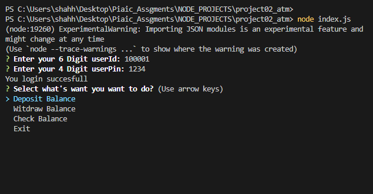

    <h1>project00_calculator</h1>
    <h2>Simple Command Line Calculator</h2>
    
Develop a simple command line calculator using TypeScipt, Node.js and Inquirer.

    <h3>NPX command:</h3>
    
<b>npx shah-calculator</b>

    <h3>output:</h3>
    

        
    

    

    <h1>project01_number_guessing-game</h1>
    <h2>Number Guessing Game</h2>
    
This guess the number game is a short TypeScript/Node.js project that allows the user to guess the number generated by the computer. There are also several ways to alter the game, like adding more rounds or displaying the score. It’s quite simple and uses the random function to generate a number.
  
Create a GitHub repository for the project and submit its URL in the project submission form.

    <h3>NPX command:</h3>
    
<b>npx shah-cli-guessing_game</b>

    <h3>output:</h3>
    

       

    

    

    <h1>project02_atm</h1>
    <h2>ATM</h2>
    
This somewhat complex TypeScript/Node.js project is a console-based application. When the system starts the user is prompted with a user id and user pin. After entering the details successfully, the ATM functionalities are unlocked. All the user data is generated randomly.
  

<h2>Want to login:</h2>

userId: 100001

userPin:1234

<h4>For more see the userData.json</h4>
    <h3>NPX command:</h3>
    
<b>shah-project02_atm</b>

    <h3>output:</h3>
    

       

    

    

